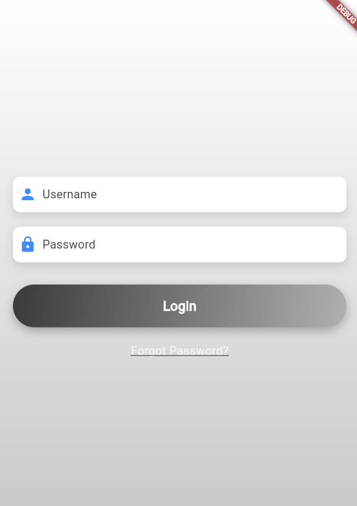
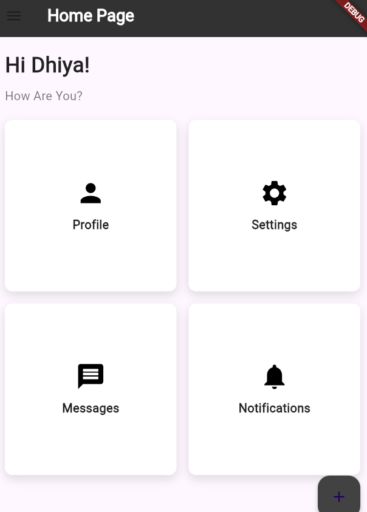
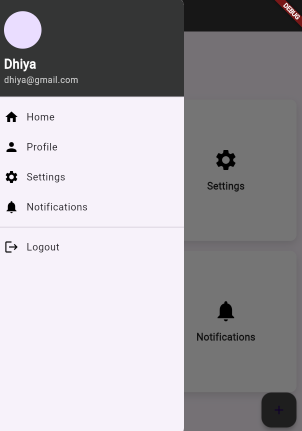

# Tugas Pertemuan 3

Nama : Dhiya Ulhaq Ayyuasy
NIM : H1D021040
Shift Baru: D

## Screenshot

1. MaterialApp dan routes
Pada bagian ini, aplikasi didefinisikan dengan MaterialApp yang menjadi struktur utama aplikasi Flutter. Properti pentingnya adalah:

initialRoute: Menentukan rute awal yang akan ditampilkan saat aplikasi diluncurkan. Dalam contoh ini, rutenya adalah HomePage.
routes: Ini adalah map dari string (nama rute) ke widget yang ditampilkan. Dalam kode di atas, ada dua rute:
'/': Untuk halaman utama (HomePage)
'/profile': Untuk halaman profile (ProfilePage)

2. Navigasi Menggunakan Navigator.pushNamed()
Pada bagian ini, navigasi antar halaman dilakukan menggunakan fungsi Navigator.pushNamed(). Ketika user menekan tombol Profile atau memilih Profile di menu samping, aplikasi akan berpindah ke halaman profile yang sudah didefinisikan di routes.

3. Scaffold dan Struktur Halaman
Scaffold adalah komponen penting dalam Flutter untuk membangun layout halaman. Komponen-komponen utama yang terdapat di dalam Scaffold ini adalah:

AppBar: Header halaman, di sini diberi teks Home Page dengan warna putih.
Drawer: Menu samping (side menu) yang dapat dibuka dan menampilkan daftar pilihan seperti Home, Profile, Settings, dan Logout.
GridView.count: Digunakan untuk menampilkan fitur-fitur aplikasi dalam bentuk kotak-kotak seperti Profile, Settings, dll.

4. Drawer dan Navigasi Menu Samping
Drawer adalah bagian dari aplikasi yang menyediakan navigasi samping. Setiap pilihan pada menu ini, seperti Home atau Profile, dapat membawa pengguna ke halaman yang berbeda.

5. SharedPreferences (untuk login di file login_page.dart)
Di halaman login (tidak ditampilkan di atas, tetapi dari kode sebelumnya), SharedPreferences digunakan untuk menyimpan informasi login, sehingga pengguna tetap masuk selama aplikasi berjalan, atau hingga ia keluar.
